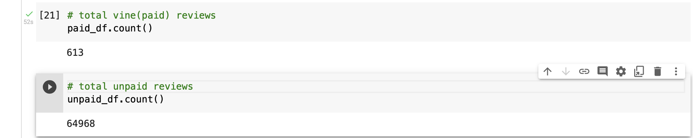
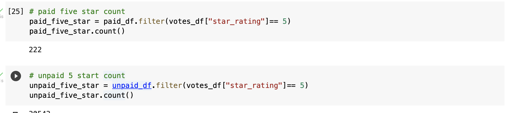
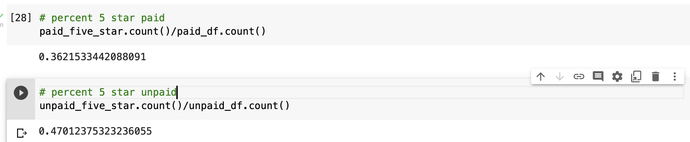

# Amazon_Vine_Analysis

## Overview
In this project we analyzed Amazon reviews from the Amazon Vine program for wireless products. We perfomed the ETL process used AWS RDS instancce and PySpark to perform analysis on the reviews between paid reviews and unpaid reviews to determine if there is any bias toward favorable reviews from Vine members.
## Results
### How many Vine reviews and non-Vine reviews were there?
There are 613 vine reviews and 64,968 non-vine reviews

### How many Vine reviews were 5 stars? How many non-Vine reviews were 5 stars?
There are 222 five star vine reviews and 30,543 five star non-vine reviews.

### What percentage of Vine reviews were 5 stars? What percentage of non-Vine reviews were 5 stars?
36 percent of vine reviews were 5 stars while 47 percent of non-vine reviews were 5 stars.

## Summary
There does not seem to be any positive bais in the vine program as there was a smaller percentage of 5 star reviews in the vine program than in non-vine. One additional analysis could be on how many 1 star reviews there are in both vine and non-vine reviews.